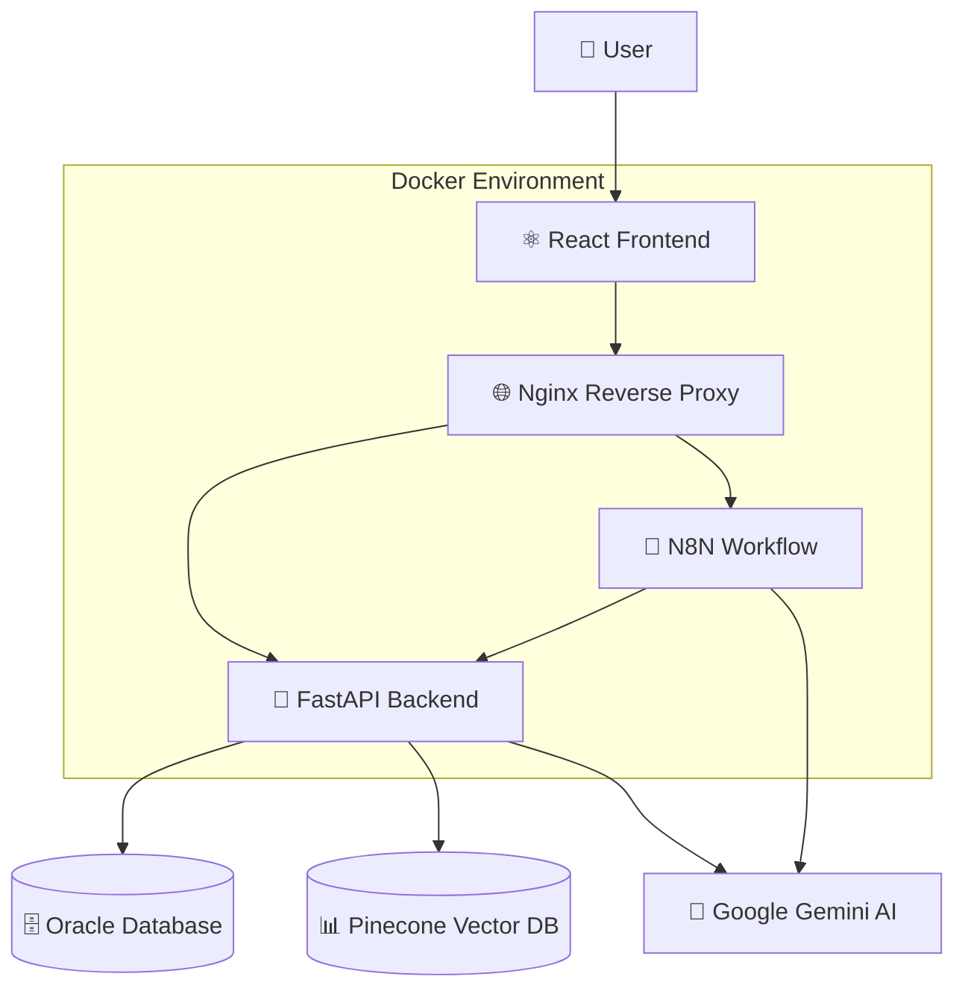

# Oracle AI Chatbot

[](https://www.docker.com/)
[](https://fastapi.tiangolo.com/)
[](https://reactjs.org/)
[](https://www.oracle.com/database/)

## 🎯 Project Overview

The **Oracle AI Chatbot** is a sophisticated full-stack web application that transforms natural language queries into SQL, executes them against an Oracle Database, and returns structured, human-readable results. This solution integrates modern web technologies with AI-powered SQL generation and comprehensive session management.

### 🌟 Key Features

- **🤖 AI-Powered SQL Generation**: Converts natural language to SQL using Google Gemini AI
- **🗄️ Oracle Database Integration**: Direct connection with Oracle Instant Client
- **💬 Interactive Chat Interface**: Modern React-based chat UI with session management
- **🔐 JWT Authentication**: Secure user authentication with cookie-based sessions
- **📊 Vector Search**: Pinecone-powered semantic search for database metadata
- **🔄 N8N Workflow Integration**: Automated workflow processing for AI responses
- **🐳 Docker Ready**: Complete containerization with Docker Compose
- **🌐 Production Ready**: Nginx reverse proxy with health checks and monitoring

---

## 🏗️ Architecture



---

## 🚀 Quick Start

### Prerequisites

- **Docker** and **Docker Compose** installed
- **Oracle Database** accessible from deployment environment
- **Google AI API Key** for Gemini integration
- **Pinecone API Key** for vector search (optional)

### 1. Clone and Setup

```bash
git clone <repository-url>
cd AI-Oracle-Chatbot
```

### 2. Configure Environment

```bash
# Copy environment templates
cp env.example .env
cp frontend/env.example frontend/.env

# Edit .env files with your configuration
# See Environment Configuration section below
```

### 3. Deploy with Docker

#### Windows:
```powershell
.\deploy.ps1
```

#### Linux/Mac:
```bash
chmod +x deploy.sh
./deploy.sh
```

#### Manual Deployment:
```bash
docker-compose up -d --build
```

### 4. Access the Application

- **Frontend**: http://localhost
- **Backend API**: http://localhost/api
- **N8N Interface**: http://localhost/n8n (if enabled)
- **Health Check**: http://localhost/health

---

## 📁 Project Structure

```
AI-Oracle-Chatbot/
├── 📁 backend/                    # FastAPI Backend
│   ├── 🐳 Dockerfile             # Backend container config
│   ├── 📄 main.py                 # FastAPI application
│   ├── 📄 ai_handler.py          # AI integration (Gemini)
│   ├── 📄 db_handler.py           # Oracle DB operations
│   ├── 📄 embedder.py             # Text embedding utilities
│   ├── 📄 pinecone_utils.py       # Vector search operations
│   ├── 📄 oracle_metadata.py      # Database metadata extraction
│   ├── 📁 auth/                   # Authentication module
│   │   ├── 📄 auth_routes.py      # Auth endpoints
│   │   └── 📄 auth_service.py     # Auth business logic
│   ├── 📁 sessions/               # Session management
│   │   ├── 📄 session_router.py   # Session endpoints
│   │   └── 📄 session_service.py  # Session business logic
│   └── 📄 requirements.txt        # Python dependencies
├── 📁 frontend/                   # React Frontend
│   ├── 🐳 Dockerfile             # Frontend container config
│   ├── 📄 nginx.conf              # Frontend nginx config
│   ├── 📁 src/
│   │   ├── 📄 App.jsx             # Main React component
│   │   ├── 📁 components/         # React components
│   │   │   ├── 📄 chat-ui.jsx     # Chat interface
│   │   │   ├── 📄 input-area.jsx  # Message input
│   │   │   ├── 📄 login.jsx        # Login form
│   │   │   └── 📁 ui/             # UI components
│   │   ├── 📁 auth/               # Authentication context
│   │   ├── 📁 services/           # API services
│   │   └── 📁 lib/                # Utilities
│   └── 📄 package.json             # NPM dependencies
├── 📁 nginx/                      # Nginx Configuration
│   ├── 📄 nginx.conf              # Main nginx config
│   └── 📁 conf.d/
│       └── 📄 default.conf         # Site routing
├── 📁 workflows/                  # N8N Workflows
│   ├── 📄 readme.md               # Workflow documentation
│   └── 📄 updated!.json           # N8N workflow definition
├── 🐳 docker-compose.yml          # Service orchestration
├── 📄 deploy.sh                   # Linux/Mac deployment script
├── 📄 deploy.ps1                   # Windows deployment script
├── 📄 CHANGES.md                  # Change documentation
├── 📄 DEPLOYMENT.md               # Deployment guide
└── 📄 env.example                  # Environment template
```

---

## 🔧 Environment Configuration

### Backend Environment (.env)

```env
# Database Configuration
DB_HOST=your_oracle_host
DB_PORT=1521
DB_SERVICE_NAME=your_service_name
DB_USERNAME=your_username
DB_PASSWORD=your_password

# JWT Configuration
JWT_SECRET_KEY=your-super-secret-jwt-key-minimum-32-characters
JWT_ALGORITHM=HS256
JWT_ACCESS_TOKEN_EXPIRE_MINUTES=30

# AI Service Configuration
GOOGLE_AI_API_KEY=your_google_ai_api_key
PINECONE_API_KEY=your_pinecone_api_key
PINECONE_ENVIRONMENT=your_pinecone_environment
PINECONE_INDEX_NAME=oracle-metadata

# N8N Configuration
N8N_WEBHOOK_URL=http://localhost:5678/webhook-test/your-webhook-id
```

### Frontend Environment (frontend/.env)

```env
# API Configuration
REACT_APP_API_BASE_URL=http://localhost/api
REACT_APP_N8N_URL=http://localhost/webhook/your-webhook-id
```

---

## 🔌 API Endpoints

### Authentication (`/auth`)

| Method | Endpoint | Description | Auth Required |
|--------|----------|-------------|---------------|
| POST | `/auth/login` | User login | ❌ |
| POST | `/auth/logout` | User logout | ✅ |
| GET | `/auth/me` | Get current user | ✅ |

### Sessions (`/sessions`)

| Method | Endpoint | Description | Auth Required |
|--------|----------|-------------|---------------|
| POST | `/sessions/create` | Create new session | ✅ |
| GET | `/sessions/list` | Get user sessions | ✅ |
| GET | `/sessions/{id}/messages` | Get session messages | ✅ |
| POST | `/sessions/{id}/messages` | Store message | ✅ |
| DELETE | `/sessions/{id}` | Delete session | ✅ |
| PUT | `/sessions/{id}/rename` | Rename session | ✅ |

### Core API (`/`)

| Method | Endpoint | Description | Auth Required |
|--------|----------|-------------|---------------|
| POST | `/query` | Generate SQL and execute | ❌ |
| GET | `/db-direct` | Direct database query | ❌ |
| POST | `/similar-metadata` | Semantic metadata search | ❌ |
| POST | `/embed-metadata` | Generate embeddings | ❌ |
| GET | `/refresh-metadata` | Refresh DB metadata cache | ❌ |
| GET | `/health` | Health check | ❌ |

---

## 🛠️ Development Setup

### Backend Development

```bash
cd backend

# Create virtual environment
python -m venv venv

# Activate virtual environment
# Windows:
venv\Scripts\activate
# Linux/Mac:
source venv/bin/activate

# Install dependencies
pip install -r requirements.txt

# Setup Oracle Instant Client
# Download from Oracle website and extract
# Initialize thick mode in your code:
# oracledb.init_oracle_client(lib_dir="path/to/instantclient")

# Run development server
uvicorn main:app --reload --host 0.0.0.0 --port 8000
```

### Frontend Development

```bash
cd frontend

# Install dependencies
npm install

# Run development server
npm run dev
```

---

## 🐳 Docker Services

### Service Overview

| Service | Port | Description |
|---------|------|-------------|
| **nginx** | 80, 443 | Reverse proxy and load balancer |
| **backend** | 8000 | FastAPI application |
| **frontend** | 3000 | React application (internal) |
| **n8n** | 5678 | Workflow automation (optional) |

### Service Management

```bash
# Start all services
docker-compose up -d

# View service status
docker-compose ps

# View logs
docker-compose logs -f [service-name]

# Stop services
docker-compose down

# Restart services
docker-compose restart

# Clean up
docker-compose down --volumes --remove-orphans
docker system prune -f
```

---

## 🔍 Monitoring and Health Checks

### Health Check Endpoints

- **Backend**: http://localhost:8000/health
- **Frontend**: http://localhost:3000/health
- **Nginx**: http://localhost/health

### Monitoring Commands

```bash
# Check service health
curl http://localhost/health

# View service logs
docker-compose logs --tail=100 backend

# Check service status
docker-compose ps
```

---

## 🔐 Security Features

- **JWT Authentication**: Secure token-based authentication
- **CORS Protection**: Configured for production environments
- **Rate Limiting**: API endpoints protected with rate limiting
- **Security Headers**: XSS protection, content type sniffing prevention
- **Input Validation**: Pydantic models for request validation
- **SQL Injection Protection**: Parameterized queries and validation

---

## 🚨 Troubleshooting

### Common Issues

1. **Port Conflicts**
   ```bash
   # Check if ports are in use
   netstat -tulpn | grep :80
   netstat -tulpn | grep :8000
   ```

2. **Database Connection Issues**
   ```bash
   # Check Oracle connectivity
   docker-compose logs backend | grep -i oracle
   ```

3. **Environment Variables**
   ```bash
   # Verify environment configuration
   docker-compose config
   ```

4. **Docker Resources**
   ```bash
   # Check Docker resources
   docker system df
   docker system prune -f
   ```

### Debug Commands

```bash
# Enter backend container
docker-compose exec backend bash

# Check database connection
docker-compose exec backend python -c "import oracledb; print('Oracle client available')"

# View detailed logs
docker-compose logs --tail=100 --follow backend
```

---

## 📚 Comprehensive Documentation

### 📖 Complete Documentation Suite
- **[Documentation Index](docs/README.md)** - Complete documentation overview and navigation
- **[API Documentation](docs/API.md)** - Complete API reference with examples
- **[Backend Architecture](docs/BACKEND.md)** - FastAPI services and AI integration
- **[Frontend Components](docs/FRONTEND.md)** - React component architecture guide
- **[Database Schema](docs/DATABASE.md)** - Complete database structure and relationships
- **[N8N Workflows](docs/N8N.md)** - Workflow automation and AI integration
- **[Troubleshooting Guide](docs/TROUBLESHOOTING.md)** - Comprehensive issue resolution
- **[Contributing Guidelines](docs/CONTRIBUTING.md)** - Development workflow and standards

### 🚀 Quick Reference
- **[CHANGES.md](CHANGES.md)** - Detailed change log and development history
- **[DEPLOYMENT.md](DEPLOYMENT.md)** - Quick deployment guide

---

## 🤝 Contributing

1. Fork the repository
2. Create a feature branch (`git checkout -b feature/amazing-feature`)
3. Commit your changes (`git commit -m 'Add amazing feature'`)
4. Push to the branch (`git push origin feature/amazing-feature`)
5. Open a Pull Request

### Development Guidelines

- Follow PEP 8 for Python code
- Use ESLint for JavaScript/React code
- Write comprehensive tests
- Update documentation for new features
- Follow semantic versioning

---

## 📄 License

This project is licensed under the MIT License - see the [LICENSE](LICENSE) file for details.

---

## 🙏 Acknowledgments

- **FastAPI** - Modern, fast web framework for building APIs
- **React** - A JavaScript library for building user interfaces
- **Oracle** - Enterprise database management system
- **Google Gemini** - Advanced AI model for natural language processing
- **Pinecone** - Vector database for similarity search
- **N8N** - Workflow automation platform
- **Docker** - Containerization platform

---

## 📞 Support

For support and questions:

- 📧 Email: [your-email@domain.com]
- 🐛 Issues: [GitHub Issues](https://github.com/your-repo/issues)
- 📖 Documentation: [Project Wiki](https://github.com/your-repo/wiki)

---

**Made with ❤️ for efficient database querying**