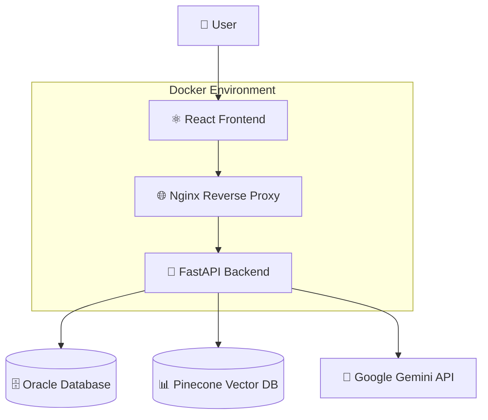

# Oracle AI Chatbot – Complete Documentation

[](https://www.docker.com/)  
[](https://fastapi.tiangolo.com/)  
[](https://reactjs.org/)  
[](https://www.oracle.com/database/)  

---

## 🎯 Project Overview

The **Oracle AI Chatbot** is a full-stack application that allows users to query an Oracle Database using **plain natural language**.  

The chatbot:  
1. **Understands questions** using **Google Gemini API**.  
2. **Generates SQL** queries dynamically.  
3. **Uses Pinecone vector search** to reference Oracle database metadata for context.  
4. **Executes SQL** queries on an Oracle Database.  
5. **Displays results** in a modern, chat-style frontend.  

This project demonstrates **AI + Database + Web Development + Cloud Integration** in one complete system.  

---

## 🏗️ System Architecture


```mermaid
graph TB
    User[👤 User] --> Frontend[⚛️ React Frontend]
    Frontend --> Nginx[🌐 Nginx Reverse Proxy]
    Nginx --> Backend[🐍 FastAPI Backend]
    
    Backend --> Oracle[(🗄 Oracle Database)]
    Backend --> Pinecone[(📊 Pinecone Vector DB)]
    Backend --> Gemini[🤖 Google Gemini API]
    
    subgraph "Docker Environment"
        Frontend
        Backend
        Nginx
    end
```

---

## 🔄 Example Workflow (Step-by-Step)

Here’s what happens when a user asks:  

**“Show me employees hired after 2020”**

1. **Frontend (React)**  
   - User logs in via the UI (credentials sent to backend for authentication).  
   - User types the question in the chat UI.  
   - The message, along with the **auth token**, is sent to the backend API.  

2. **Backend (FastAPI)**  
   - Receives request and validates user’s authentication token against **Oracle DB**.  
   - Forwards the authenticated query to the main **n8n workflow** via webhook.  

3. **n8n Workflow (Orchestration & AI)**  
   - **Metadata Retrieval**: Performs vector search on pre-computed Oracle schema embeddings to find relevant context.  
   - **SQL Generation**: Uses **Gemini API** with query + metadata to generate Oracle SQL:  

     ```sql
     SELECT employee_id, first_name, last_name, hire_date
     FROM employees
     WHERE hire_date > DATE '2020-01-01';
     ```

   - **Execution**: Runs the generated SQL against Oracle Database.  

4. **Oracle Database**  
   - Executes the SQL query securely.  
   - Returns results to **n8n workflow**.  

5. **n8n → Backend → Frontend**  
   - n8n sends results back to Backend via webhook response.  
   - Backend formats results into JSON.  
   - Frontend displays results in chat interface.  

**Final Output (example):**

| Employee ID | First Name | Last Name | Hire Date   |
|-------------|------------|-----------|-------------|
| 101         | Alice      | Khan      | 2021-03-15  |
| 115         | David      | Singh     | 2022-07-22  |

---

## 🛠️ Architecture & Components

### 1. Frontend (React + TailwindCSS)
- Chat-style user interface.  
- Authentication and session management.  
- REST API communication with backend.  

### 2. Backend (FastAPI + Python)
- Central API gateway and orchestrator.  
- **Key Responsibilities:**  
  - JWT Authentication against Oracle DB.  
  - Webhook handling and n8n workflow triggering.  
  - Data proxy between frontend and n8n.  
  - Logging and error handling.  

### 3. n8n Workflows (Automation Engine)
- Three core workflows:  
  - **Metadata Embedding Workflow**: Periodic job that generates and stores vector embeddings of Oracle schema.  
  - **Main Query Workflow**: Production workflow triggered by webhook – handles metadata retrieval, AI SQL generation, and query execution.  
  - **Testing Workflow**: Manual chat-triggered workflow for development and testing.  

### 4. Oracle Database
- Primary business data storage.  
- User authentication source.  
- Direct query execution by n8n via **oracledb driver**.  

### 5. Google Gemini API
- Natural language to SQL generation.  
- Enhanced with relevant schema context from metadata embeddings.  
- Requires **Gemini API key** configured in n8n.  

### 6. Vector Database (Pinecone/ChromaDB)
- Stores Oracle database metadata embeddings.  
- Enables semantic search for relevant tables/columns.  
- Populated by periodic n8n workflow.  

### 7. Docker & Docker Compose
- Containerized services (frontend, backend, n8n).  
- Common internal network for secure communication.  
- Consistent runtime environment and simplified deployment.  

### 8. Deployment
- Internal network deployment on shared server.  
- Services exposed on common network IP:  
  **http://sql-bot.lotte.internal**  
- Nginx reverse proxy for traffic routing.  
- Accessible to all employees.  


## 🛠️ Prerequisites

### System Requirements
- **OS:** Linux / macOS / Windows (with WSL2 recommended).  
- **RAM:** 8 GB minimum (16 GB recommended).  
- **Disk space:** ~5 GB.  

### Software Requirements
- **Python 3.10+** → for backend (if running manually).  
- **Node.js 18+** → for frontend (if running manually).  
- **Oracle Instant Client** → required for Oracle DB connections.  
- **Docker + Docker Compose** → for containerized deployment.  

### Required API Keys
- **Oracle Database**:  
  - `DB_USER`, `DB_PASSWORD`, `DB_DSN`  
- **Google Gemini API Key**:  
  - From [Google AI Studio](https://ai.google.dev/)  
- **Pinecone API Key**:  
  - From [Pinecone Console](https://www.pinecone.io/console/)  

---

## 🚀 Quick Start with Docker

```bash
# Clone the repository
git clone <repository-url>
cd AI-Oracle-Chatbot

# Build and start services
docker-compose up -d --build

# Check services
docker-compose ps
```

### Access
- **Frontend** → http://localhost  
- **Backend API** → http://localhost/api  
- **Health Check** → http://localhost/health  

---

## 🔧 Configuration

### Backend `.env`
```env
INSTANT_CLIENT=D:\instantclient_23_9

GEMINI_API_KEY=your_gemini_api_key
PINECONE_API_KEY=your_pinecone_api_key

DB_USER=tif
DB_PASSWORD=tif
DB_DSN=10.0.0.28:1523/prod

PINECONE_INDEX_NAME=oracle-metadata
PINECONE_NAMESPACE="ai oracle metadata"

JWT_SECRET="my_secret_key"
JWT_ALGORITHM="HS256"
```

⚠️ Notes:  
- Ensure `INSTANT_CLIENT` points to a valid installation path.  
- Update `DB_DSN` with the correct IP/port/service name of Oracle DB.  
- Replace API keys with valid credentials.  

### Frontend Configuration
- The frontend does **not** require a `.env` file.  
- Instead, update the **API base URL in service files** to use your **system IP address**.  

Example:  
```js
// Example in frontend services
const API_BASE_URL = "http://192.168.1.100/api";
```

⚠️ **Important:** Always replace `localhost` with your **system’s IP** so other machines can access the chatbot.  

---

## 🛠️ Development Setup (Manual, Without Docker)

### Backend
```bash
cd backend
python -m venv venv
source venv/bin/activate   # Windows: venv\Scripts\activate
pip install -r requirements.txt

uvicorn main:app --reload --port 8000
```

### Frontend
```bash
cd frontend
npm install
npm run dev
```

Then open → http://localhost:3000  

---

---

## 🛠️ Deployment Setup (Requires Docker)

### Up
```bash
docker compose build

docker compose up
```

### Down

```bash     
docker compose down
```

### Restart a Specific Service 
```bash
docker restart <name of the service>
```
***Note:*** Services are listed in docker-compose.yml

### Force Recreate
```bash
docker compose up -d --build --force-recreate
```

Then open → http://localhost:3000  

---

## 📁 Project Structure

```
AI-Oracle-Chatbot/
├── backend/             # FastAPI backend
│   ├── main.py
│   ├── db_handler.py
│   ├── ai_handler.py
│   ├── auth/ …
├── frontend/            # React frontend
│   ├── src/
│   ├── package.json
├── nginx/               # Reverse proxy configs
├── docker-compose.yml   # Multi-service orchestration
├── deploy.sh / ps1      # Deployment scripts
└── docs/                # Extended documentation
```

---

## 🐳 How Docker Works Here

- **Backend container** → Runs FastAPI + Oracle client.  
- **Frontend container** → Builds and serves React app.  
- **Nginx container** → Routes requests to backend/frontend.  

**Why Docker?**
- Consistent across all systems.  
- No need to manually install Node.js or Python dependencies.  
- Easy to clean and reset with one command.  
- Portable → can be deployed anywhere with Docker installed.  

---

## 🐳 Docker Desktop and Why It’s Helpful

### What is Docker Desktop?  
[Docker Desktop](https://www.docker.com/products/docker-desktop/) is a graphical application for Windows and macOS that bundles:  
- **Docker Engine** (runs containers)  
- **Docker Compose** (runs multiple containers together)  
- **Container management UI** (visual way to see containers, images, logs, volumes)  

### Why Use Docker Desktop for This Project?  
The Oracle AI Chatbot runs multiple services (**frontend, backend, Nginx**) that need to communicate with each other. Docker Desktop simplifies this by:  

1. **One-Click Startup** – Run `docker-compose up` and all containers start automatically.  
2. **Unified Environment** – No need to manually install Node.js or Python dependencies — containers already include them.  
3. **Cross-Platform Consistency** – Works the same on Windows, macOS, and Linux.  
4. **Easy Debugging** – You can open Docker Desktop → see running containers → check logs.  
5. **Resource Management** – Configure how much CPU/RAM Docker can use (helpful if running on a laptop).  
6. **Networking Made Simple** – All services run inside a private Docker network, connected automatically.  

### Example: Viewing Containers in Docker Desktop
When you start the chatbot with:
```bash
docker-compose up -d --build
```
You’ll see in Docker Desktop:  
- **backend** → FastAPI + Oracle client  
- **frontend** → React app served via Nginx  
- **nginx** → Reverse proxy handling routing  

Each container can be inspected for logs, CPU/memory usage, and health status.  

---

## 🔍 Health Checks

- Backend → http://localhost:8000/health  
- Frontend → http://localhost:3000/health  
- Nginx → http://localhost/health  

---

## 🚨 Troubleshooting

1. **Port conflicts**  
   ```bash
   netstat -tulpn | grep :80
   netstat -tulpn | grep :8000
   ```

2. **Oracle DB connection issues**  
   ```bash
   docker-compose logs backend | grep -i oracle
   ```

3. **Check env variables**  
   ```bash
   docker-compose config
   ```

4. **Reset everything**  
   ```bash
   docker-compose down --volumes --remove-orphans
   docker system prune -f
   ```

---

## 🔐 Security Features

- JWT Authentication  
- Secure password handling  
- CORS protection  
- Rate limiting on API endpoints  
- SQL injection prevention via parameterized queries  

---

## 📄 License

MIT License – see [LICENSE](LICENSE)

---

