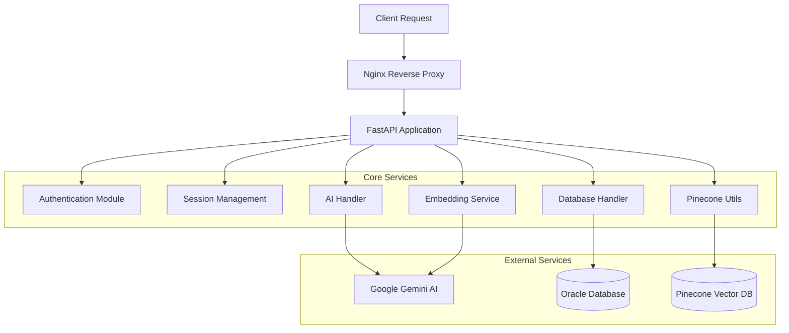

# Backend Architecture Documentation

## Overview

The Oracle AI Chatbot backend is built with FastAPI and provides a robust, scalable API for natural language to SQL conversion, database operations, authentication, and session management.

**Technology Stack:**
- **FastAPI 0.116.1** - Modern, fast web framework for building APIs
- **Oracle Database** - Enterprise database with Instant Client
- **Google Gemini AI** - Advanced AI model for SQL generation
- **Pinecone** - Vector database for semantic search
- **JWT Authentication** - Secure token-based authentication
- **Pydantic** - Data validation and serialization
- **Uvicorn** - ASGI server for production deployment

---

## 🏗️ Architecture Overview



---

## 📁 Project Structure

```
backend/
├── 📄 main.py                    # FastAPI application entry point
├── 📄 ai_handler.py              # AI integration and SQL generation
├── 📄 db_handler.py              # Oracle database operations
├── 📄 embedder.py                # Text embedding utilities
├── 📄 pinecone_utils.py          # Vector search operations
├── 📄 oracle_metadata.py        # Database metadata extraction
├── 📄 requirements.txt           # Python dependencies
├── 📁 auth/                      # Authentication module
│   ├── 📄 auth_routes.py         # Authentication endpoints
│   └── 📄 auth_service.py        # Authentication business logic
├── 📁 sessions/                  # Session management module
│   ├── 📄 session_router.py      # Session endpoints
│   └── 📄 session_service.py     # Session business logic
└── 📁 logs/                      # Application logs
    ├── 📄 ai_handler.log          # AI operation logs
    └── 📄 db_errors.log           # Database error logs
```

---

## 🚀 Core Services

### Main Application (main.py)

**Purpose**: FastAPI application entry point with route registration and middleware configuration.

**Key Features:**
- **CORS Configuration**: Cross-origin resource sharing setup
- **Route Registration**: Authentication and session routes
- **Health Check**: Service monitoring endpoint
- **Startup Events**: Metadata preloading on startup

**Configuration:**
```python
app = FastAPI(
    title="AI-Powered Oracle Chatbot API",
    description="Converts user prompts into SQL queries, executes them on Oracle DB, and returns the results.",
    version="1.0.0"
)

# CORS middleware for frontend integration
origins = [
    "http://localhost:5173",   # Frontend development
    "http://localhost:5678",   # N8N workflow
    "http://10.0.1.31:5173",   # Alternative frontend
    "http://10.0.1.31:4173",   # Alternative frontend
    "http://10.0.1.31:5678"    # Alternative N8N
]
```

**Endpoints:**
- `POST /query` - Natural language to SQL conversion
- `GET /db-direct` - Direct database query execution
- `POST /similar-metadata` - Semantic metadata search
- `POST /embed-metadata` - Generate database embeddings
- `GET /refresh-metadata` - Refresh metadata cache
- `GET /health` - Health check endpoint

---

### AI Handler (ai_handler.py)

**Purpose**: Integrates with Google Gemini AI to generate SQL queries from natural language prompts.

**Key Functions:**
```python
def generate_sql_from_prompt(prompt: str) -> str:
    """Generate SQL query from natural language prompt"""
```

**Features:**
- **Context-Aware**: Uses database metadata for accurate SQL generation
- **Error Handling**: Comprehensive error logging and recovery
- **Prompt Engineering**: Structured prompts for consistent results
- **SQL Validation**: Ensures generated SQL is syntactically correct

**AI Integration Flow:**
1. **Extract Metadata**: Retrieve database schema information
2. **Build Context**: Create structured prompt with metadata
3. **Generate SQL**: Send prompt to Gemini AI
4. **Validate Output**: Ensure SQL is executable
5. **Return Result**: Clean and return SQL query

**Prompt Structure:**
```python
system_prompt = (
    "You are an expert AI specialized in generating SQL queries strictly for Oracle Database systems.\n\n"
    "**Database Metadata Context:**\n"
    f"{metadata}\n\n"
    "RULES:\n"
    "- Respond with ONLY a syntactically correct SQL query.\n"
    "- Do not include any explanations, notes, or markdown formatting.\n"
    "- Use the provided metadata for column names, table relationships, and constraints.\n"
    "- Avoid using 'dual' unless required.\n"
    "- Always prefer joins only when there are foreign key relationships.\n"
)
```

---

### Database Handler (db_handler.py)

**Purpose**: Manages Oracle Database connections and operations with comprehensive error handling.

**Key Functions:**
```python
def get_connection() -> oracledb.Connection:
    """Establish Oracle database connection"""

def execute_query(query: str, params: dict = None) -> list | dict:
    """Execute SQL query with parameters"""

def extract_db_metadata(force_refresh: bool = False) -> dict:
    """Extract database schema metadata"""

def parameterize_query(query: str) -> tuple:
    """Convert query to parameterized form"""

def is_safe_query(query: str) -> bool:
    """Validate query safety"""
```

**Features:**
- **Connection Pooling**: Efficient database connection management
- **Retry Logic**: Automatic reconnection on failures
- **Metadata Caching**: Cached schema information for performance
- **SQL Injection Protection**: Parameterized queries and validation
- **Error Logging**: Comprehensive error tracking

**Database Connection:**
```python
def get_connection():
    return oracledb.connect(
        user=DB_USER,
        password=DB_PASSWORD,
        dsn=DB_DSN,
        mode=oracledb.AUTH_MODE_DEFAULT
    )
```

**Metadata Extraction:**
- **Table Information**: Table names, columns, data types
- **Relationship Mapping**: Foreign key relationships
- **Constraint Details**: Primary keys, unique constraints
- **Index Information**: Database indexes for optimization

---

### Embedding Service (embedder.py)

**Purpose**: Generates text embeddings using Google Gemini's embedding model for semantic search.

**Key Functions:**
```python
def embed_texts(texts: list[str], task_type="RETRIEVAL_DOCUMENT") -> list[list[float]]:
    """Generate embeddings for text inputs"""
```

**Features:**
- **Batch Processing**: Efficient embedding generation
- **Error Handling**: Graceful failure handling
- **Task-Specific**: Optimized for retrieval tasks
- **Vector Output**: Returns normalized embedding vectors

**Integration with Pinecone:**
- **Vector Storage**: Stores embeddings in Pinecone
- **Similarity Search**: Enables semantic metadata search
- **Index Management**: Handles vector index operations

---

### Pinecone Utils (pinecone_utils.py)

**Purpose**: Manages vector database operations for semantic search functionality.

**Key Functions:**
```python
def query_similar_metadata(query: str, top_k: int = 5) -> list:
    """Search for similar metadata using vector similarity"""

def upsert_embeddings(vectors: list, metadata: list) -> bool:
    """Store embeddings in Pinecone index"""
```

**Features:**
- **Semantic Search**: Find relevant database metadata
- **Vector Operations**: Efficient similarity calculations
- **Index Management**: Handle Pinecone index lifecycle
- **Metadata Integration**: Combine vectors with database metadata

---

### Oracle Metadata (oracle_metadata.py)

**Purpose**: Extracts and processes Oracle database metadata for AI context and vector search.

**Key Functions:**
```python
def full_metadata_embedding_pipeline(owner: str = None) -> dict:
    """Complete pipeline: extract → embed → store metadata"""

def extract_table_metadata(table_name: str) -> dict:
    """Extract detailed metadata for specific table"""
```

**Features:**
- **Schema Extraction**: Comprehensive database schema analysis
- **Relationship Mapping**: Foreign key and constraint analysis
- **Metadata Processing**: Structured metadata for AI consumption
- **Embedding Pipeline**: End-to-end metadata processing

---

## 🔐 Authentication System

### Authentication Routes (auth/auth_routes.py)

**Purpose**: Handles user authentication endpoints with JWT token management.

**Endpoints:**
- `POST /auth/login` - User authentication
- `POST /auth/logout` - User logout
- `GET /auth/me` - Current user information

**Features:**
- **JWT Tokens**: Secure token-based authentication
- **Cookie Management**: HTTP-only cookies for security
- **Password Hashing**: Bcrypt password hashing
- **Session Management**: Secure session handling

### Authentication Service (auth/auth_service.py)

**Purpose**: Business logic for authentication operations.

**Key Functions:**
```python
def authenticate_user(username: str, password: str) -> dict | None:
    """Authenticate user credentials"""

def create_access_token(data: dict) -> str:
    """Generate JWT access token"""

def get_current_user_from_cookie(request: Request) -> dict:
    """Extract user from authentication cookie"""
```

**Security Features:**
- **Password Verification**: Secure password comparison
- **Token Generation**: JWT token creation with expiration
- **User Validation**: Database user verification
- **Error Handling**: Secure error responses

---

## 💬 Session Management

### Session Router (sessions/session_router.py)

**Purpose**: Handles chat session CRUD operations.

**Endpoints:**
- `POST /sessions/create` - Create new session
- `GET /sessions/list` - Get user sessions
- `GET /sessions/{id}/messages` - Get session messages
- `POST /sessions/{id}/messages` - Store message
- `DELETE /sessions/{id}` - Delete session
- `PUT /sessions/{id}/rename` - Rename session

**Features:**
- **CRUD Operations**: Complete session management
- **Message Persistence**: Store chat messages
- **User Association**: Link sessions to users
- **Validation**: Input validation and error handling

### Session Service (sessions/session_service.py)

**Purpose**: Business logic for session operations.

**Key Functions:**
```python
def create_session(user_id: int, title: str = None) -> dict:
    """Create new chat session"""

def get_user_sessions(user_id: int) -> list:
    """Get all sessions for user"""

def store_message(session_id: int, role: str, content: str) -> dict:
    """Store message in session"""

def get_session_messages(session_id: int) -> list:
    """Retrieve session messages"""
```

---

## 🗄️ Database Schema

### Core Tables

**Users Table:**
```sql
CREATE TABLE users (
    user_id NUMBER PRIMARY KEY,
    username VARCHAR2(50) UNIQUE NOT NULL,
    password_hash VARCHAR2(255) NOT NULL,
    created_at TIMESTAMP DEFAULT CURRENT_TIMESTAMP
);
```

**Sessions Table:**
```sql
CREATE TABLE sessions (
    session_id NUMBER PRIMARY KEY,
    user_id NUMBER REFERENCES users(user_id),
    title VARCHAR2(255),
    created_at TIMESTAMP DEFAULT CURRENT_TIMESTAMP
);
```

**Messages Table:**
```sql
CREATE TABLE messages (
    message_id NUMBER PRIMARY KEY,
    session_id NUMBER REFERENCES sessions(session_id),
    role VARCHAR2(20) NOT NULL, -- 'user' or 'assistant'
    content CLOB NOT NULL,
    created_at TIMESTAMP DEFAULT CURRENT_TIMESTAMP
);
```

---

## 🔧 Configuration Management

### Environment Variables

**Database Configuration:**
```env
DB_HOST=your_oracle_host
DB_PORT=1521
DB_SERVICE_NAME=your_service_name
DB_USERNAME=your_username
DB_PASSWORD=your_password
INSTANT_CLIENT=/path/to/instantclient
```

**AI Service Configuration:**
```env
GOOGLE_AI_API_KEY=your_google_ai_api_key
GEMINI_API_KEY=your_gemini_api_key
```

**Vector Database Configuration:**
```env
PINECONE_API_KEY=your_pinecone_api_key
PINECONE_ENVIRONMENT=your_pinecone_environment
PINECONE_INDEX_NAME=oracle-metadata
```

**JWT Configuration:**
```env
JWT_SECRET_KEY=your-super-secret-jwt-key-minimum-32-characters
JWT_ALGORITHM=HS256
JWT_ACCESS_TOKEN_EXPIRE_MINUTES=30
```

---

## 🚨 Error Handling

### Error Types

**Database Errors:**
```python
try:
    result = execute_query(query, params)
except oracledb.DatabaseError as e:
    logger.error(f"Database error: {str(e)}")
    return JSONResponse(
        status_code=500,
        content={"success": False, "error": "Database connection failed"}
    )
```

**AI Service Errors:**
```python
try:
    sql = generate_sql_from_prompt(prompt)
except Exception as e:
    logger.error(f"AI generation error: {str(e)}")
    return JSONResponse(
        status_code=500,
        content={"success": False, "error": "AI service unavailable"}
    )
```

**Authentication Errors:**
```python
if not authenticate_user(username, password):
    raise HTTPException(
        status_code=401,
        detail="Invalid credentials"
    )
```

---

## 📊 Logging and Monitoring

### Log Configuration

**AI Handler Logging:**
```python
logging.basicConfig(
    filename='ai_handler.log',
    filemode='a',
    level=logging.INFO,
    format='%(asctime)s - %(name)s - %(levelname)s - %(message)s'
)
```

**Database Error Logging:**
```python
logging.basicConfig(
    filename="db_errors.log",
    level=logging.ERROR
)
```

### Health Monitoring

**Health Check Endpoint:**
```python
@app.get("/health")
def health_check():
    return {
        "status": "healthy",
        "service": "Oracle AI Chatbot API",
        "timestamp": datetime.utcnow().isoformat()
    }
```

---

## 🔒 Security Features

### Input Validation

**Pydantic Models:**
```python
class QueryRequest(BaseModel):
    prompt: str
    
class LoginRequest(BaseModel):
    username: str
    password: str
```

**SQL Injection Protection:**
```python
def is_safe_query(query: str) -> bool:
    """Validate query safety"""
    dangerous_patterns = [
        r'\b(DROP|DELETE|INSERT|UPDATE|ALTER|CREATE)\b',
        r'\b(EXEC|EXECUTE|SP_|XP_)\b',
        r'--|\/\*|\*\/',
        r'\b(UNION|SELECT.*FROM.*SELECT)\b'
    ]
    return not any(re.search(pattern, query, re.IGNORECASE) for pattern in dangerous_patterns)
```

### Authentication Security

**JWT Token Security:**
- **Secret Key**: Strong secret key for token signing
- **Expiration**: Short-lived access tokens
- **HTTP-Only Cookies**: Secure cookie storage
- **CORS Configuration**: Restricted origin access

---

## 🚀 Performance Optimizations

### Database Optimizations

**Connection Pooling:**
```python
def connect_with_retry(max_retries=3, delay=2):
    """Retry connection logic for reliability"""
    for attempt in range(max_retries):
        try:
            return get_connection()
        except oracledb.DatabaseError as e:
            if attempt == max_retries - 1:
                raise e
            time.sleep(delay)
```

**Metadata Caching:**
```python
_cached_metadata = None

def extract_db_metadata(force_refresh=False):
    """Cache metadata for performance"""
    global _cached_metadata
    if _cached_metadata is None or force_refresh:
        _cached_metadata = _extract_metadata()
    return _cached_metadata
```

### API Optimizations

**Async Operations:**
- **Non-blocking I/O**: FastAPI's async capabilities
- **Concurrent Requests**: Handle multiple requests efficiently
- **Response Caching**: Cache frequent responses

---

## 🧪 Testing Strategy

### Unit Testing

```python
def test_generate_sql_from_prompt():
    """Test SQL generation functionality"""
    prompt = "Show me all users"
    result = generate_sql_from_prompt(prompt)
    assert result.startswith("SELECT")
    assert "users" in result.lower()

def test_database_connection():
    """Test database connectivity"""
    conn = get_connection()
    assert conn is not None
    conn.close()
```

### Integration Testing

```python
def test_query_endpoint():
    """Test complete query flow"""
    response = client.post("/query", json={"prompt": "Show me all users"})
    assert response.status_code == 200
    data = response.json()
    assert "generated_sql" in data
    assert "results" in data
```

---

## 📚 Additional Resources

- [FastAPI Documentation](https://fastapi.tiangolo.com/)
- [Oracle Database Documentation](https://docs.oracle.com/en/database/)
- [Google Gemini API Documentation](https://ai.google.dev/docs)
- [Pinecone Documentation](https://docs.pinecone.io/)
- [JWT Authentication Guide](https://jwt.io/introduction/)
- [Pydantic Documentation](https://pydantic-docs.helpmanual.io/)

