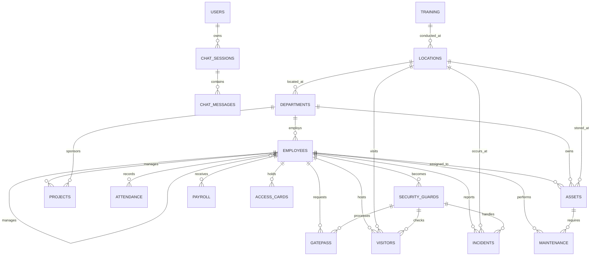

# Database Schema Documentation

## Overview

The Oracle AI Chatbot uses Oracle Database to store user authentication, chat sessions, messages, and comprehensive business data for AI-powered SQL generation. The database schema includes both application-specific tables and a rich business domain model for realistic query scenarios.

---

## 🗄️ Database Architecture



---

## 🔐 Application Tables

### Users Table

**Purpose**: Stores user authentication information for the chatbot application.

```sql
CREATE TABLE users (
    user_id NUMBER PRIMARY KEY,
    username VARCHAR2(50) UNIQUE NOT NULL,
    password_hash VARCHAR2(255) NOT NULL,
    email VARCHAR2(100),
    created_at TIMESTAMP DEFAULT CURRENT_TIMESTAMP,
    last_login TIMESTAMP,
    status VARCHAR2(20) DEFAULT 'ACTIVE'
);
```

**Columns:**
- `user_id` (NUMBER, PRIMARY KEY) - Unique user identifier
- `username` (VARCHAR2(50), UNIQUE, NOT NULL) - User login name
- `password_hash` (VARCHAR2(255), NOT NULL) - Bcrypt hashed password
- `email` (VARCHAR2(100)) - User email address
- `created_at` (TIMESTAMP, DEFAULT CURRENT_TIMESTAMP) - Account creation time
- `last_login` (TIMESTAMP) - Last login timestamp
- `status` (VARCHAR2(20), DEFAULT 'ACTIVE') - Account status

**Indexes:**
- Primary key on `user_id`
- Unique index on `username`
- Index on `email`

---

### Chat Sessions Table

**Purpose**: Stores chat conversation sessions for users.

```sql
CREATE TABLE chat_sessions (
    id NUMBER PRIMARY KEY,
    user_id NUMBER NOT NULL,
    title VARCHAR2(255),
    started_at TIMESTAMP DEFAULT CURRENT_TIMESTAMP,
    last_activity TIMESTAMP DEFAULT CURRENT_TIMESTAMP,
    status VARCHAR2(20) DEFAULT 'ACTIVE',
    CONSTRAINT fk_session_user FOREIGN KEY (user_id) REFERENCES users(user_id)
);
```

**Columns:**
- `id` (NUMBER, PRIMARY KEY) - Unique session identifier
- `user_id` (NUMBER, NOT NULL) - Reference to users table
- `title` (VARCHAR2(255)) - Session title/name
- `started_at` (TIMESTAMP, DEFAULT CURRENT_TIMESTAMP) - Session start time
- `last_activity` (TIMESTAMP, DEFAULT CURRENT_TIMESTAMP) - Last message time
- `status` (VARCHAR2(20), DEFAULT 'ACTIVE') - Session status

**Constraints:**
- Foreign key to `users(user_id)`
- Check constraint on `status` ('ACTIVE', 'ARCHIVED', 'DELETED')

---

### Chat Messages Table

**Purpose**: Stores individual messages within chat sessions.

```sql
CREATE TABLE chat_messages (
    id NUMBER PRIMARY KEY,
    session_id NUMBER NOT NULL,
    role VARCHAR2(20) NOT NULL,
    content CLOB NOT NULL,
    created_at TIMESTAMP DEFAULT CURRENT_TIMESTAMP,
    metadata CLOB,
    CONSTRAINT fk_message_session FOREIGN KEY (session_id) REFERENCES chat_sessions(id),
    CONSTRAINT chk_message_role CHECK (role IN ('user', 'assistant', 'system'))
);
```

**Columns:**
- `id` (NUMBER, PRIMARY KEY) - Unique message identifier
- `session_id` (NUMBER, NOT NULL) - Reference to chat_sessions table
- `role` (VARCHAR2(20), NOT NULL) - Message sender ('user', 'assistant', 'system')
- `content` (CLOB, NOT NULL) - Message content (supports markdown)
- `created_at` (TIMESTAMP, DEFAULT CURRENT_TIMESTAMP) - Message timestamp
- `metadata` (CLOB) - Additional message metadata (JSON)

**Constraints:**
- Foreign key to `chat_sessions(id)`
- Check constraint on `role` values
- Not null constraints on required fields

---

## 🏢 Business Domain Tables

### Locations Table

**Purpose**: Stores physical locations/offices for the organization.

```sql
CREATE TABLE LOCATIONS (
    location_id NUMBER PRIMARY KEY,
    location_name VARCHAR2(100) NOT NULL,
    address VARCHAR2(200),
    city VARCHAR2(50),
    state VARCHAR2(50),
    postal_code VARCHAR2(10),
    country VARCHAR2(50) DEFAULT 'USA',
    created_date DATE DEFAULT SYSDATE
);
```

**Sample Data:**
- Headquarters (New York, NY)
- West Coast Office (San Francisco, CA)
- East Coast Branch (Boston, MA)
- South Office (Atlanta, GA)
- Midwest Center (Chicago, IL)

---

### Departments Table

**Purpose**: Organizational departments with location and budget information.

```sql
CREATE TABLE DEPARTMENTS (
    dept_id NUMBER PRIMARY KEY,
    dept_name VARCHAR2(100) NOT NULL,
    dept_code VARCHAR2(10) UNIQUE,
    location_id NUMBER,
    budget NUMBER(12,2),
    manager_id NUMBER,
    created_date DATE DEFAULT SYSDATE,
    CONSTRAINT fk_dept_location FOREIGN KEY (location_id) REFERENCES LOCATIONS(location_id),
    CONSTRAINT fk_dept_manager FOREIGN KEY (manager_id) REFERENCES EMPLOYEES(emp_id)
);
```

**Sample Departments:**
- Information Technology (IT)
- Human Resources (HR)
- Finance (FIN)
- Operations (OPS)
- Marketing (MKT)
- Security (SEC)
- Legal (LEG)
- Procurement (PROC)
- Research & Development (RND)
- Quality Assurance (QA)

---

### Employees Table

**Purpose**: Employee information with department and management relationships.

```sql
CREATE TABLE EMPLOYEES (
    emp_id NUMBER PRIMARY KEY,
    emp_code VARCHAR2(20) UNIQUE NOT NULL,
    first_name VARCHAR2(50) NOT NULL,
    last_name VARCHAR2(50) NOT NULL,
    email VARCHAR2(100) UNIQUE,
    phone VARCHAR2(20),
    hire_date DATE DEFAULT SYSDATE,
    job_title VARCHAR2(100),
    salary NUMBER(10,2),
    dept_id NUMBER,
    manager_id NUMBER,
    status VARCHAR2(20) DEFAULT 'ACTIVE',
    created_date DATE DEFAULT SYSDATE,
    CONSTRAINT fk_emp_dept FOREIGN KEY (dept_id) REFERENCES DEPARTMENTS(dept_id),
    CONSTRAINT fk_emp_manager FOREIGN KEY (manager_id) REFERENCES EMPLOYEES(emp_id)
);
```

**Key Features:**
- Self-referencing foreign key for management hierarchy
- Department assignment
- Unique employee codes
- Status tracking (ACTIVE, INACTIVE, TERMINATED)

---

### Security Guards Table

**Purpose**: Security personnel with specialized certifications and permissions.

```sql
CREATE TABLE SECURITY_GUARDS (
    guard_id NUMBER PRIMARY KEY,
    emp_id NUMBER NOT NULL,
    license_number VARCHAR2(50) UNIQUE,
    certification_level VARCHAR2(20),
    shift_preference VARCHAR2(20),
    weapon_permit VARCHAR2(1) DEFAULT 'N',
    training_expiry DATE,
    status VARCHAR2(20) DEFAULT 'ACTIVE',
    created_date DATE DEFAULT SYSDATE,
    CONSTRAINT fk_guard_emp FOREIGN KEY (emp_id) REFERENCES EMPLOYEES(emp_id)
);
```

**Certification Levels:**
- Level 1: Basic security
- Level 2: Intermediate security
- Level 3: Advanced security

---

### Projects Table

**Purpose**: Project management with department sponsorship and manager assignment.

```sql
CREATE TABLE PROJECTS (
    project_id NUMBER PRIMARY KEY,
    project_name VARCHAR2(100) NOT NULL,
    project_code VARCHAR2(20) UNIQUE,
    description CLOB,
    start_date DATE,
    end_date DATE,
    budget NUMBER(12,2),
    status VARCHAR2(20) DEFAULT 'ACTIVE',
    dept_id NUMBER,
    project_manager_id NUMBER,
    created_date DATE DEFAULT SYSDATE,
    CONSTRAINT fk_proj_dept FOREIGN KEY (dept_id) REFERENCES DEPARTMENTS(dept_id),
    CONSTRAINT fk_proj_manager FOREIGN KEY (project_manager_id) REFERENCES EMPLOYEES(emp_id)
);
```

**Project Statuses:**
- ACTIVE: Currently running
- COMPLETED: Finished successfully
- CANCELLED: Terminated early
- ON_HOLD: Temporarily suspended

---

### Gatepass Table

**Purpose**: Employee exit/entry tracking with security guard processing.

```sql
CREATE TABLE GATEPASS (
    gatepass_id NUMBER PRIMARY KEY,
    gatepass_number VARCHAR2(50) UNIQUE NOT NULL,
    emp_id NUMBER NOT NULL,
    purpose VARCHAR2(200),
    exit_time TIMESTAMP,
    expected_return TIMESTAMP,
    actual_return TIMESTAMP,
    approved_by NUMBER,
    guard_out NUMBER,
    guard_in NUMBER,
    status VARCHAR2(20) DEFAULT 'PENDING',
    items_carried CLOB,
    created_date DATE DEFAULT SYSDATE,
    CONSTRAINT fk_gatepass_emp FOREIGN KEY (emp_id) REFERENCES EMPLOYEES(emp_id),
    CONSTRAINT fk_gatepass_approver FOREIGN KEY (approved_by) REFERENCES EMPLOYEES(emp_id),
    CONSTRAINT fk_gatepass_guard_out FOREIGN KEY (guard_out) REFERENCES SECURITY_GUARDS(guard_id),
    CONSTRAINT fk_gatepass_guard_in FOREIGN KEY (guard_in) REFERENCES SECURITY_GUARDS(guard_id)
);
```

**Gatepass Statuses:**
- PENDING: Awaiting approval
- APPROVED: Ready for exit
- ACTIVE: Currently out
- COMPLETED: Returned successfully
- OVERDUE: Past expected return time

---

### Attendance Table

**Purpose**: Employee attendance tracking with overtime calculation.

```sql
CREATE TABLE ATTENDANCE (
    attendance_id NUMBER PRIMARY KEY,
    emp_id NUMBER NOT NULL,
    attendance_date DATE NOT NULL,
    check_in_time TIMESTAMP,
    check_out_time TIMESTAMP,
    total_hours NUMBER(4,2),
    overtime_hours NUMBER(4,2) DEFAULT 0,
    status VARCHAR2(20) DEFAULT 'PRESENT',
    remarks VARCHAR2(200),
    created_date DATE DEFAULT SYSDATE,
    CONSTRAINT fk_att_emp FOREIGN KEY (emp_id) REFERENCES EMPLOYEES(emp_id),
    CONSTRAINT uk_emp_date UNIQUE (emp_id, attendance_date)
);
```

**Attendance Statuses:**
- PRESENT: Regular attendance
- ABSENT: No attendance recorded
- LATE: Late arrival
- EARLY_LEAVE: Left before scheduled time
- HALF_DAY: Partial attendance

---

### Visitors Table

**Purpose**: Visitor management with host employee and security guard tracking.

```sql
CREATE TABLE VISITORS (
    visitor_id NUMBER PRIMARY KEY,
    visitor_name VARCHAR2(100) NOT NULL,
    company VARCHAR2(100),
    phone VARCHAR2(20),
    email VARCHAR2(100),
    purpose VARCHAR2(200),
    host_emp_id NUMBER,
    entry_time TIMESTAMP DEFAULT SYSTIMESTAMP,
    exit_time TIMESTAMP,
    id_type VARCHAR2(50),
    id_number VARCHAR2(50),
    guard_id NUMBER,
    status VARCHAR2(20) DEFAULT 'IN',
    created_date DATE DEFAULT SYSDATE,
    CONSTRAINT fk_visitor_host FOREIGN KEY (host_emp_id) REFERENCES EMPLOYEES(emp_id),
    CONSTRAINT fk_visitor_guard FOREIGN KEY (guard_id) REFERENCES SECURITY_GUARDS(guard_id)
);
```

**Visitor Statuses:**
- IN: Currently on premises
- OUT: Left the premises
- EXPIRED: Visit time exceeded

---

### Assets Table

**Purpose**: Company asset tracking with assignment and location management.

```sql
CREATE TABLE ASSETS (
    asset_id NUMBER PRIMARY KEY,
    asset_tag VARCHAR2(50) UNIQUE NOT NULL,
    asset_name VARCHAR2(100) NOT NULL,
    category VARCHAR2(50),
    brand VARCHAR2(50),
    model VARCHAR2(50),
    serial_number VARCHAR2(100),
    purchase_date DATE,
    purchase_cost NUMBER(12,2),
    assigned_to NUMBER,
    dept_id NUMBER,
    location_id NUMBER,
    status VARCHAR2(20) DEFAULT 'ACTIVE',
    warranty_expiry DATE,
    created_date DATE DEFAULT SYSDATE,
    CONSTRAINT fk_asset_emp FOREIGN KEY (assigned_to) REFERENCES EMPLOYEES(emp_id),
    CONSTRAINT fk_asset_dept FOREIGN KEY (dept_id) REFERENCES DEPARTMENTS(dept_id),
    CONSTRAINT fk_asset_location FOREIGN KEY (location_id) REFERENCES LOCATIONS(location_id)
);
```

**Asset Categories:**
- Computer: Laptops, desktops, servers
- Printer: Office printers and scanners
- Monitor: Displays and screens
- Security: Cameras and access control
- Tablet: Mobile devices
- Communication: Phones and headsets
- Presentation: Projectors and screens
- Server: Data center equipment
- Power: UPS and power equipment

---

### Maintenance Table

**Purpose**: Asset maintenance scheduling and tracking.

```sql
CREATE TABLE MAINTENANCE (
    maintenance_id NUMBER PRIMARY KEY,
    asset_id NUMBER NOT NULL,
    maintenance_type VARCHAR2(50),
    description CLOB,
    scheduled_date DATE,
    completed_date DATE,
    technician_id NUMBER,
    cost NUMBER(10,2),
    status VARCHAR2(20) DEFAULT 'SCHEDULED',
    next_maintenance DATE,
    created_date DATE DEFAULT SYSDATE,
    CONSTRAINT fk_maint_asset FOREIGN KEY (asset_id) REFERENCES ASSETS(asset_id),
    CONSTRAINT fk_maint_tech FOREIGN KEY (technician_id) REFERENCES EMPLOYEES(emp_id)
);
```

**Maintenance Types:**
- Preventive: Scheduled maintenance
- Repair: Fix broken equipment
- Upgrade: Improve functionality
- Inspection: Regular checks

---

### Training Table

**Purpose**: Employee training programs and sessions.

```sql
CREATE TABLE TRAINING (
    training_id NUMBER PRIMARY KEY,
    training_name VARCHAR2(100) NOT NULL,
    description CLOB,
    trainer_name VARCHAR2(100),
    start_date DATE,
    end_date DATE,
    max_participants NUMBER,
    cost_per_participant NUMBER(8,2),
    location_id NUMBER,
    status VARCHAR2(20) DEFAULT 'SCHEDULED',
    created_date DATE DEFAULT SYSDATE,
    CONSTRAINT fk_training_location FOREIGN KEY (location_id) REFERENCES LOCATIONS(location_id)
);
```

**Training Programs:**
- Cybersecurity Awareness
- Leadership Development
- Financial Planning
- Project Management
- Digital Marketing
- Emergency Response
- Legal Compliance
- Supply Chain Management
- Innovation Workshop
- Quality Management

---

### Payroll Table

**Purpose**: Employee salary and compensation tracking.

```sql
CREATE TABLE PAYROLL (
    payroll_id NUMBER PRIMARY KEY,
    emp_id NUMBER NOT NULL,
    pay_period_start DATE NOT NULL,
    pay_period_end DATE NOT NULL,
    basic_salary NUMBER(10,2),
    overtime_pay NUMBER(8,2) DEFAULT 0,
    allowances NUMBER(8,2) DEFAULT 0,
    deductions NUMBER(8,2) DEFAULT 0,
    gross_pay NUMBER(10,2),
    tax_deducted NUMBER(8,2),
    net_pay NUMBER(10,2),
    pay_date DATE,
    status VARCHAR2(20) DEFAULT 'CALCULATED',
    created_date DATE DEFAULT SYSDATE,
    CONSTRAINT fk_payroll_emp FOREIGN KEY (emp_id) REFERENCES EMPLOYEES(emp_id)
);
```

**Payroll Statuses:**
- CALCULATED: Payroll computed
- APPROVED: Manager approved
- PAID: Payment processed
- CANCELLED: Payment cancelled

---

### Incidents Table

**Purpose**: Security and safety incident reporting and tracking.

```sql
CREATE TABLE INCIDENTS (
    incident_id NUMBER PRIMARY KEY,
    incident_number VARCHAR2(50) UNIQUE NOT NULL,
    incident_type VARCHAR2(50),
    description CLOB,
    incident_date TIMESTAMP DEFAULT SYSTIMESTAMP,
    location_id NUMBER,
    reported_by NUMBER,
    assigned_guard NUMBER,
    severity_level VARCHAR2(20),
    status VARCHAR2(20) DEFAULT 'OPEN',
    resolution CLOB,
    resolved_date DATE,
    created_date DATE DEFAULT SYSDATE,
    CONSTRAINT fk_incident_location FOREIGN KEY (location_id) REFERENCES LOCATIONS(location_id),
    CONSTRAINT fk_incident_reporter FOREIGN KEY (reported_by) REFERENCES EMPLOYEES(emp_id),
    CONSTRAINT fk_incident_guard FOREIGN KEY (assigned_guard) REFERENCES SECURITY_GUARDS(guard_id)
);
```

**Incident Types:**
- Security Breach
- Fire Alarm
- Theft
- Vandalism
- Medical Emergency
- Power Outage
- Suspicious Activity
- Equipment Malfunction
- Vehicle Incident
- Water Leak

**Severity Levels:**
- LOW: Minor incident
- MEDIUM: Moderate impact
- HIGH: Serious incident
- CRITICAL: Emergency situation

---

### Access Cards Table

**Purpose**: Employee access card management and tracking.

```sql
CREATE TABLE ACCESS_CARDS (
    card_id NUMBER PRIMARY KEY,
    card_number VARCHAR2(50) UNIQUE NOT NULL,
    emp_id NUMBER NOT NULL,
    card_type VARCHAR2(50),
    issued_date DATE DEFAULT SYSDATE,
    expiry_date DATE,
    access_level VARCHAR2(50),
    status VARCHAR2(20) DEFAULT 'ACTIVE',
    last_used TIMESTAMP,
    created_date DATE DEFAULT SYSDATE,
    CONSTRAINT fk_card_emp FOREIGN KEY (emp_id) REFERENCES EMPLOYEES(emp_id)
);
```

**Card Types:**
- Employee: Standard access
- Manager: Enhanced access
- Director: Executive access
- Security: Security personnel access
- Contractor: Temporary access

**Access Levels:**
- Level 1: Basic areas
- Level 2: Standard offices
- Level 3: Department areas
- Level 4: Management areas
- Level 5: Executive areas

---

## 🔧 Database Configuration

### Sequences

All tables use Oracle sequences for primary key generation:

```sql
-- Application sequences
CREATE SEQUENCE users_seq START WITH 1 INCREMENT BY 1;
CREATE SEQUENCE chat_sessions_seq START WITH 1 INCREMENT BY 1;
CREATE SEQUENCE chat_messages_seq START WITH 1 INCREMENT BY 1;

-- Business domain sequences
CREATE SEQUENCE departments_seq START WITH 1 INCREMENT BY 1;
CREATE SEQUENCE locations_seq START WITH 1 INCREMENT BY 1;
CREATE SEQUENCE employees_seq START WITH 1 INCREMENT BY 1;
-- ... (additional sequences for all tables)
```

### Indexes

**Performance Indexes:**
```sql
-- User authentication
CREATE INDEX idx_users_username ON users(username);
CREATE INDEX idx_users_email ON users(email);

-- Session management
CREATE INDEX idx_sessions_user_id ON chat_sessions(user_id);
CREATE INDEX idx_sessions_started_at ON chat_sessions(started_at);
CREATE INDEX idx_messages_session_id ON chat_messages(session_id);
CREATE INDEX idx_messages_created_at ON chat_messages(created_at);

-- Business queries
CREATE INDEX idx_employees_dept_id ON employees(dept_id);
CREATE INDEX idx_employees_manager_id ON employees(manager_id);
CREATE INDEX idx_attendance_emp_date ON attendance(emp_id, attendance_date);
CREATE INDEX idx_gatepass_emp_id ON gatepass(emp_id);
CREATE INDEX idx_visitors_host_emp ON visitors(host_emp_id);
CREATE INDEX idx_assets_assigned_to ON assets(assigned_to);
```

### Constraints

**Data Integrity Constraints:**
```sql
-- Check constraints for status fields
ALTER TABLE users ADD CONSTRAINT chk_user_status 
    CHECK (status IN ('ACTIVE', 'INACTIVE', 'SUSPENDED'));

ALTER TABLE chat_sessions ADD CONSTRAINT chk_session_status 
    CHECK (status IN ('ACTIVE', 'ARCHIVED', 'DELETED'));

ALTER TABLE employees ADD CONSTRAINT chk_emp_status 
    CHECK (status IN ('ACTIVE', 'INACTIVE', 'TERMINATED'));

-- Date constraints
ALTER TABLE projects ADD CONSTRAINT chk_project_dates 
    CHECK (end_date >= start_date);

ALTER TABLE gatepass ADD CONSTRAINT chk_gatepass_dates 
    CHECK (expected_return >= exit_time);
```

---

## 📊 Sample Queries

### User Management Queries

```sql
-- Get user with latest login
SELECT username, email, last_login, status
FROM users
WHERE status = 'ACTIVE'
ORDER BY last_login DESC;

-- Count active sessions per user
SELECT u.username, COUNT(cs.id) as session_count
FROM users u
LEFT JOIN chat_sessions cs ON u.user_id = cs.user_id
WHERE u.status = 'ACTIVE'
GROUP BY u.username;
```

### Business Intelligence Queries

```sql
-- Department budget summary
SELECT d.dept_name, d.budget, COUNT(e.emp_id) as employee_count
FROM departments d
LEFT JOIN employees e ON d.dept_id = e.dept_id
GROUP BY d.dept_id, d.dept_name, d.budget
ORDER BY d.budget DESC;

-- Employee attendance summary
SELECT e.first_name, e.last_name, 
       COUNT(a.attendance_id) as days_present,
       SUM(a.total_hours) as total_hours,
       SUM(a.overtime_hours) as overtime_hours
FROM employees e
JOIN attendance a ON e.emp_id = a.emp_id
WHERE a.attendance_date >= ADD_MONTHS(SYSDATE, -1)
GROUP BY e.emp_id, e.first_name, e.last_name;

-- Asset utilization report
SELECT a.asset_name, a.category, a.status,
       e.first_name || ' ' || e.last_name as assigned_to,
       d.dept_name as department
FROM assets a
LEFT JOIN employees e ON a.assigned_to = e.emp_id
LEFT JOIN departments d ON a.dept_id = d.dept_id
WHERE a.status = 'ACTIVE'
ORDER BY a.category, a.asset_name;
```

### Security and Compliance Queries

```sql
-- Active gatepasses
SELECT gp.gatepass_number, e.first_name || ' ' || e.last_name as employee,
       gp.purpose, gp.exit_time, gp.expected_return,
       CASE WHEN gp.actual_return IS NULL AND gp.expected_return < SYSTIMESTAMP 
            THEN 'OVERDUE' ELSE gp.status END as current_status
FROM gatepass gp
JOIN employees e ON gp.emp_id = e.emp_id
WHERE gp.status IN ('ACTIVE', 'APPROVED')
ORDER BY gp.exit_time DESC;

-- Recent security incidents
SELECT i.incident_number, i.incident_type, i.severity_level,
       l.location_name, e.first_name || ' ' || e.last_name as reported_by,
       i.incident_date, i.status
FROM incidents i
JOIN locations l ON i.location_id = l.location_id
JOIN employees e ON i.reported_by = e.emp_id
WHERE i.incident_date >= ADD_MONTHS(SYSDATE, -3)
ORDER BY i.incident_date DESC;
```

---

## 🔒 Security Considerations

### Data Protection

**Sensitive Data Handling:**
- Password hashing with bcrypt
- PII data encryption for visitors
- Secure session management
- Audit logging for security events

**Access Control:**
- Role-based access control
- Database user privileges
- Application-level authorization
- API endpoint protection

### Backup and Recovery

**Backup Strategy:**
- Daily full database backups
- Transaction log backups
- Point-in-time recovery capability
- Cross-site backup replication

**Recovery Procedures:**
- Automated backup verification
- Disaster recovery testing
- Data retention policies
- Compliance reporting

---

## 📈 Performance Optimization

### Query Optimization

**Common Optimizations:**
- Proper indexing strategy
- Query plan analysis
- Statistics collection
- Partitioning for large tables

**Monitoring:**
- Database performance metrics
- Query execution times
- Resource utilization
- Connection pool monitoring

### Scalability Considerations

**Horizontal Scaling:**
- Read replicas for reporting
- Connection pooling
- Caching strategies
- Load balancing

**Vertical Scaling:**
- Memory optimization
- CPU utilization
- Storage performance
- Network optimization

---

## 📚 Additional Resources

- [Oracle Database Documentation](https://docs.oracle.com/en/database/)
- [Oracle SQL Reference](https://docs.oracle.com/en/database/oracle/oracle-database/19/sqlrf/)
- [Oracle Performance Tuning Guide](https://docs.oracle.com/en/database/oracle/oracle-database/19/tgdba/)
- [Oracle Security Guide](https://docs.oracle.com/en/database/oracle/oracle-database/19/dbseg/)

