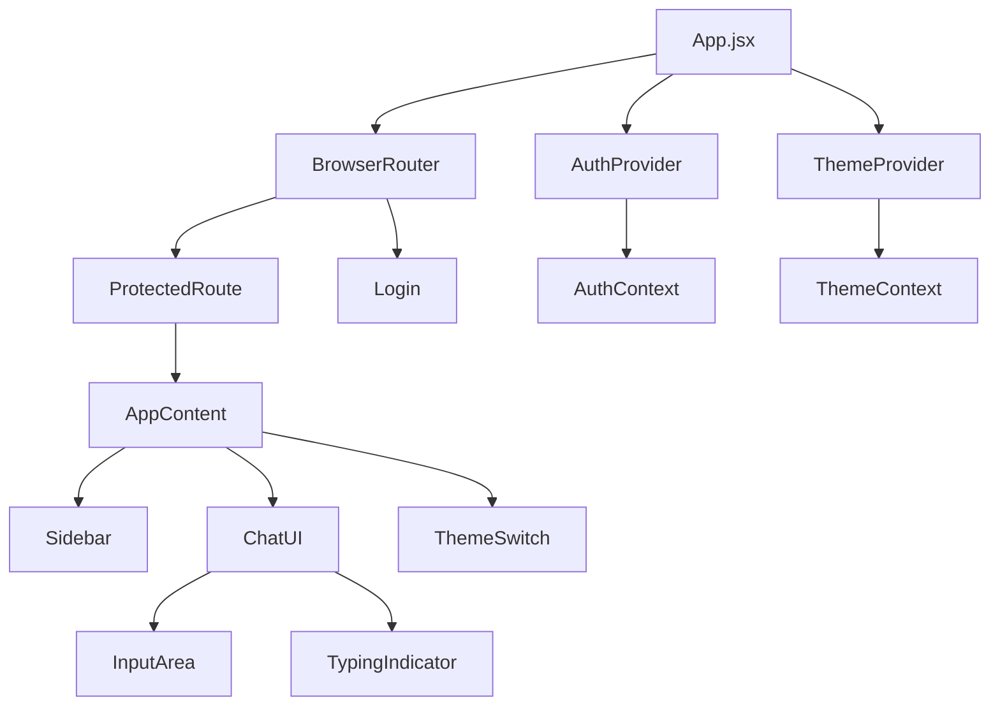

# Frontend Component Documentation

## Overview

The Oracle AI Chatbot frontend is built with React 19.1.0 and provides a modern, responsive chat interface with comprehensive session management, authentication, and theme support.

**Technology Stack:**
- **React 19.1.0** - Modern React with concurrent features
- **Vite** - Fast build tool and dev server
- **Tailwind CSS 4.1.11** - Utility-first CSS framework
- **React Router DOM 7.8.0** - Client-side routing
- **Axios 1.10.0** - HTTP client for API calls
- **React Markdown 10.1.0** - Markdown rendering
- **React Syntax Highlighter 15.6.1** - Code syntax highlighting
- **React Hot Toast 2.5.2** - Toast notifications
- **JS Cookie 3.0.5** - Cookie management

---

## 🏗️ Component Architecture



---

## 📁 Component Structure

```
src/
├── 📄 App.jsx                    # Main application component
├── 📄 main.jsx                   # Application entry point
├── 📄 index.css                  # Global styles and Tailwind imports
├── 📁 components/                # Reusable UI components
│   ├── 📄 chat-ui.jsx           # Main chat interface
│   ├── 📄 input-area.jsx         # Message input component
│   ├── 📄 login.jsx              # Login form component
│   ├── 📄 theme-context.jsx      # Theme management context
│   ├── 📄 theme-switch.jsx       # Theme toggle component
│   └── 📁 ui/                    # UI component library
│       ├── 📄 sidebar.jsx        # Sidebar navigation
│       └── 📄 typing-indicator.jsx # Loading animation
├── 📁 auth/                      # Authentication components
│   ├── 📄 authContext.jsx        # Authentication context
│   └── 📄 ProtectedRoute.jsx     # Route protection component
├── 📁 services/                  # API service layer
│   ├── 📄 authService.js         # Authentication API calls
│   ├── 📄 chatApi.js             # Chat/N8N API integration
│   └── 📄 sessions.js            # Session management API
└── 📁 lib/                       # Utility functions
    └── 📄 utils.js               # Common utilities
```

---

## 🎯 Core Components

### App.jsx

**Purpose**: Main application component that orchestrates routing, authentication, and theme management.

**Key Features:**
- Route protection with `ProtectedRoute`
- Authentication context provider
- Theme context provider
- Sidebar and chat session management

**Props**: None (root component)

**State Management:**
```javascript
const [open, setOpen] = useState(false);           // Sidebar visibility
const [chatSessions, setChatSessions] = useState([]); // User sessions
const [error, setError] = useState(null);         // Error handling
const [messages, setMessages] = useState([]);     // Current chat messages
const [currentSessionId, setCurrentSessionId] = useState(null); // Active session
```

**Key Functions:**
- `handleLogout()` - User logout with redirect
- `fetchMessages(sessionId)` - Load messages for a session
- `loadChatSessions()` - Load user's chat sessions

---

### ChatUI Component

**Purpose**: Main chat interface component that handles message display, input, and AI interaction.

**Props:**
```javascript
{
  messages: Array,              // Array of message objects
  setMessages: Function,        // State setter for messages
  currentSessionId: String,     // Current session ID
  setCurrentSessionId: Function // State setter for session ID
}
```

**State Management:**
```javascript
const [input, setInput] = useState("");           // Message input
const [isStreaming, setIsStreaming] = useState(false); // AI response status
```

**Key Features:**
- **Message Rendering**: Supports markdown with syntax highlighting
- **Auto-scroll**: Automatically scrolls to latest message
- **Session Management**: Creates sessions automatically
- **Message Persistence**: Saves messages to database
- **N8N Integration**: Sends messages to N8N workflow

**Message Flow:**
1. User types message → `handleSendMessage()`
2. Add user message to state
3. Create placeholder assistant message
4. Send to N8N workflow via `sendToN8n()`
5. Update assistant message with AI response
6. Save both messages to database

---

### InputArea Component

**Purpose**: Handles message input with send functionality and keyboard shortcuts.

**Props:**
```javascript
{
  input: String,                // Current input value
  setInput: Function,           // Input state setter
  onSendMessage: Function,      // Send message callback
  disabled: Boolean             // Input disabled state
}
```

**Features:**
- **Enter to Send**: Press Enter to send message
- **Shift+Enter**: Add new line
- **Auto-resize**: Textarea grows with content
- **Send Button**: Click to send message
- **Disabled State**: Prevents input during AI response

---

### Login Component

**Purpose**: User authentication form with validation and error handling.

**State Management:**
```javascript
const [email, setEmail] = useState("");           // Email input
const [password, setPassword] = useState("");     // Password input
const [isLoading, setIsLoading] = useState(false); // Loading state
```

**Features:**
- **Form Validation**: Client-side validation
- **Loading States**: Visual feedback during login
- **Error Handling**: Displays authentication errors
- **Auto-redirect**: Redirects to chat after successful login

---

## 🔐 Authentication System

### AuthContext

**Purpose**: Global authentication state management using React Context.

**Context Value:**
```javascript
{
  user: Object | null,          // Current user data
  token: Object | null,         // JWT token
  isLoading: Boolean,          // Authentication loading state
  login: Function,             // Login function
  logout: Function              // Logout function
}
```

**Key Functions:**
- `login(email, password)` - Authenticate user
- `logout()` - Clear authentication state
- `checkAuthStatus()` - Verify current authentication

**Authentication Flow:**
1. App starts → Check existing authentication
2. User logs in → Store token and user data
3. Protected routes → Verify authentication
4. User logs out → Clear state and redirect

### ProtectedRoute Component

**Purpose**: Route protection component that redirects unauthenticated users.

**Props:**
```javascript
{
  children: ReactNode          // Protected component
}
```

**Features:**
- **Loading State**: Shows loading while checking auth
- **Redirect**: Redirects to login if not authenticated
- **Auth Check**: Uses `fetchMe()` to verify authentication

---

## 🎨 Theme System

### ThemeContext

**Purpose**: Global theme management (light/dark mode).

**Context Value:**
```javascript
{
  theme: String,               // "light" or "dark"
  toggleTheme: Function        // Toggle between themes
}
```

**Features:**
- **Persistent**: Theme preference saved to localStorage
- **System Default**: Respects system theme preference
- **Global Access**: Available throughout component tree

### ThemeSwitch Component

**Purpose**: Theme toggle button with visual feedback.

**Features:**
- **Icon Animation**: Smooth transition between themes
- **Accessibility**: Proper ARIA labels
- **Visual Feedback**: Shows current theme state

---

## 📡 Service Layer

### authService.js

**Purpose**: Authentication API service layer.

**Functions:**
```javascript
loginUser(email, password)     // User login
logoutUser()                   // User logout
fetchMe()                      // Get current user info
```

**Features:**
- **Cookie Management**: Handles authentication cookies
- **Error Handling**: Comprehensive error management
- **Request Timeouts**: 5-second timeout for auth requests

### chatApi.js

**Purpose**: Chat and N8N workflow integration.

**Functions:**
```javascript
sendToN8n(userMessage, token)  // Send message to N8N workflow
```

**Features:**
- **N8N Integration**: Sends messages to N8N webhook
- **Token Handling**: Includes authentication token
- **Error Handling**: Comprehensive error management
- **Request Timeouts**: 30-second timeout for AI requests

### sessions.js

**Purpose**: Chat session management API.

**Functions:**
```javascript
createSession(title)           // Create new session
getSessions()                  // Get user sessions
getMessages(sessionId)         // Get session messages
storeMessages(sessionId, message) // Store message
```

**Features:**
- **CRUD Operations**: Complete session management
- **Error Handling**: Comprehensive error management
- **Request Timeouts**: 10-second timeout for session requests

---

## 🎯 UI Components

### Sidebar Component

**Purpose**: Navigation sidebar with session management.

**Features:**
- **Session List**: Displays user's chat sessions
- **New Chat**: Button to start new conversation
- **Session Navigation**: Click to load specific session
- **Responsive**: Collapsible on mobile devices

**Session Management:**
- **Create Session**: Automatically creates sessions
- **Load Session**: Click to load session messages
- **Session Titles**: Auto-generated or user-defined

### TypingIndicator Component

**Purpose**: Visual indicator for AI response loading.

**Features:**
- **Animated Dots**: Bouncing animation
- **Theme Aware**: Adapts to current theme
- **Accessibility**: Screen reader friendly

---

## 🔄 State Management

### Message State Structure

```javascript
const message = {
  role: "user" | "assistant",  // Message sender
  content: String,             // Message content (markdown)
  timestamp: Date,             // Message timestamp
  sessionId: String            // Associated session ID
}
```

### Session State Structure

```javascript
const session = {
  session_id: String,          // Unique session identifier
  title: String,               // Session title
  created_at: Date,           // Creation timestamp
  user_id: Number             // Associated user ID
}
```

---

## 🎨 Styling and Theming

### Tailwind CSS Configuration

**Custom Classes:**
- **Theme Variables**: CSS custom properties for theming
- **Dark Mode**: Automatic dark mode support
- **Responsive**: Mobile-first responsive design
- **Animations**: Smooth transitions and animations

### Component Styling Patterns

```javascript
// Theme-aware styling
const className = `bg-${theme === 'dark' ? 'gray-800' : 'white'} 
                   text-${theme === 'dark' ? 'white' : 'black'}`;

// Conditional styling
className={`p-4 rounded-lg ${
  isActive ? 'bg-blue-500 text-white' : 'bg-gray-100 text-gray-800'
}`}
```

---

## 🚀 Performance Optimizations

### React Optimizations

- **useCallback**: Memoized event handlers
- **useMemo**: Computed values caching
- **useEffect**: Proper dependency arrays
- **Refs**: Direct DOM manipulation for scrolling

### Bundle Optimization

- **Code Splitting**: Route-based code splitting
- **Tree Shaking**: Unused code elimination
- **Asset Optimization**: Image and font optimization
- **Lazy Loading**: Component lazy loading

---

## 🧪 Testing Considerations

### Component Testing

```javascript
// Example test structure
describe('ChatUI Component', () => {
  it('renders messages correctly', () => {
    // Test message rendering
  });
  
  it('handles message sending', () => {
    // Test message sending flow
  });
  
  it('manages session state', () => {
    // Test session management
  });
});
```

### Integration Testing

- **API Integration**: Test service layer
- **Authentication Flow**: Test login/logout
- **Session Management**: Test session CRUD operations
- **Theme Switching**: Test theme persistence

---

## 🔧 Development Guidelines

### Component Development

1. **Single Responsibility**: Each component has one clear purpose
2. **Props Validation**: Use PropTypes or TypeScript
3. **Error Boundaries**: Implement error handling
4. **Accessibility**: Follow WCAG guidelines
5. **Performance**: Optimize re-renders

### Code Organization

1. **File Naming**: Use PascalCase for components
2. **Import Order**: External → Internal → Relative
3. **Export Pattern**: Default export for components
4. **Constants**: Extract magic numbers and strings

---

## 📱 Responsive Design

### Breakpoints

- **Mobile**: < 768px
- **Tablet**: 768px - 1024px
- **Desktop**: > 1024px

### Mobile Optimizations

- **Touch Targets**: Minimum 44px touch targets
- **Swipe Gestures**: Sidebar swipe to open/close
- **Keyboard Handling**: Proper keyboard management
- **Viewport**: Proper viewport meta tag

---

## 🔍 Debugging Tools

### React Developer Tools

- **Component Tree**: Inspect component hierarchy
- **Props**: View component props and state
- **Profiler**: Performance analysis
- **Hooks**: Debug custom hooks

### Browser DevTools

- **Network**: Monitor API calls
- **Console**: Error logging and debugging
- **Storage**: Inspect localStorage and cookies
- **Performance**: Analyze rendering performance

---

## 📚 Additional Resources

- [React Documentation](https://react.dev/)
- [Tailwind CSS Documentation](https://tailwindcss.com/docs)
- [React Router Documentation](https://reactrouter.com/)
- [Axios Documentation](https://axios-http.com/docs/intro)
- [React Markdown Documentation](https://github.com/remarkjs/react-markdown)

